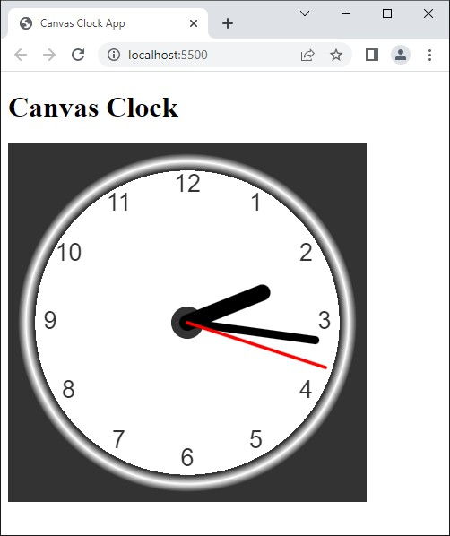
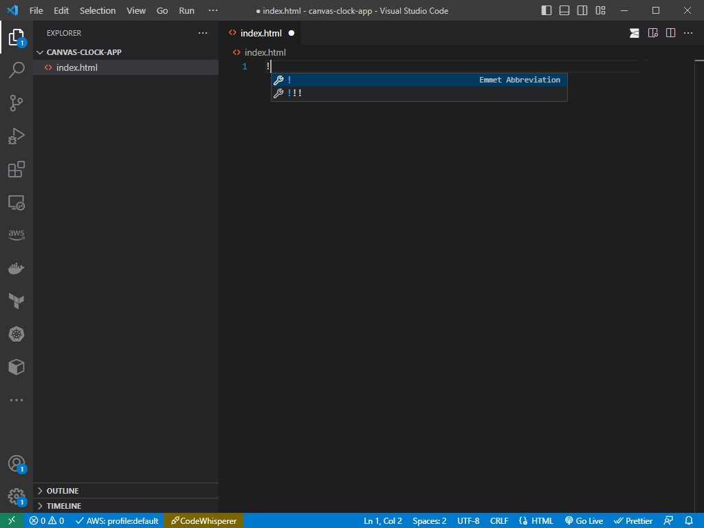
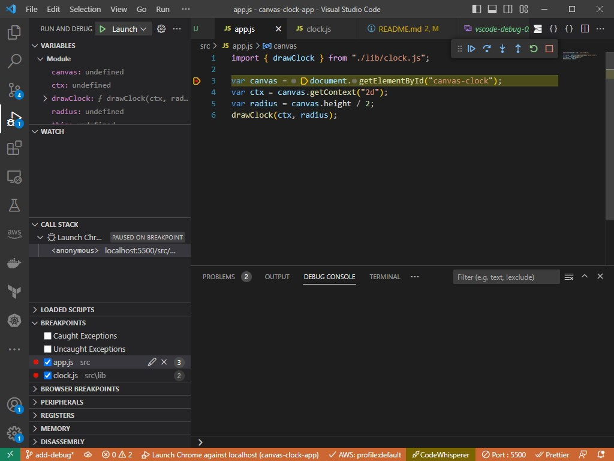

# canvas-clock-app

Exercise to use the HTML Canvas.

[Canvas Clock Tutorial](https://www.w3schools.com/graphics/canvas_clock.asp)

## 1. Setup

1. Create `index.html`.
2. Type '!' (exclamation mark) then click `Tab` button. The content of the `index.html` will be populated.
3. Click the `Go Live` on the bottom task bar to run the live server.

## 2. Add debug configuration

1. Go to **Debug** panel on the left _Activity Bar_. Click on _create a launch.json file_ link.
2. Select _Web App (Chrome)_ from the from the drop-down list. Change the _web port_ to the **Live Server** port (see it on the _Status Bar_ on the bottom). It's `5500` in this example.
3. Start the **RUN AND DEBUG** by clicking on the start button of `Launch Chrome`.
4. Now the it's running in _debug mode_ and stop at an active breakpoint.

